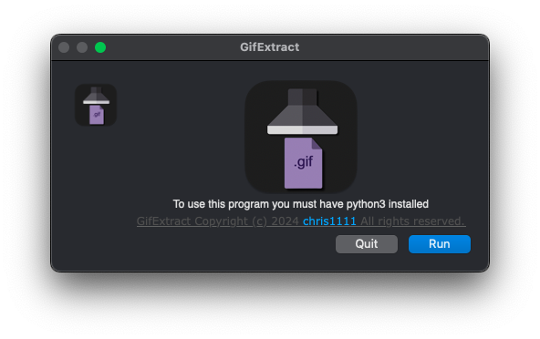

# GifExtract
Extract gif's images frames from macOS
- To use this program you must have python3 installed

Download: ➤ [GifExtract](https://github.com/chris1111/GifExtract/raw/Master/GifExtract.zip)

- 

